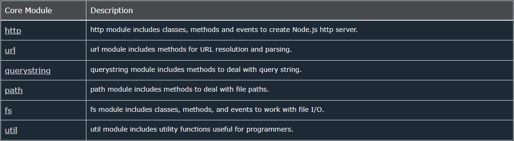

### [Types of modules in Node.js](https://www.tutorialsteacher.com/nodejs/nodejs-modules)

#### _**Local :**_

- _Created locally in Node.js application._

#### _**Core :**_



[Install Core module :](https://www.npmjs.com/package/node)

```
npm i node
```

#### _**Third Party :**_
